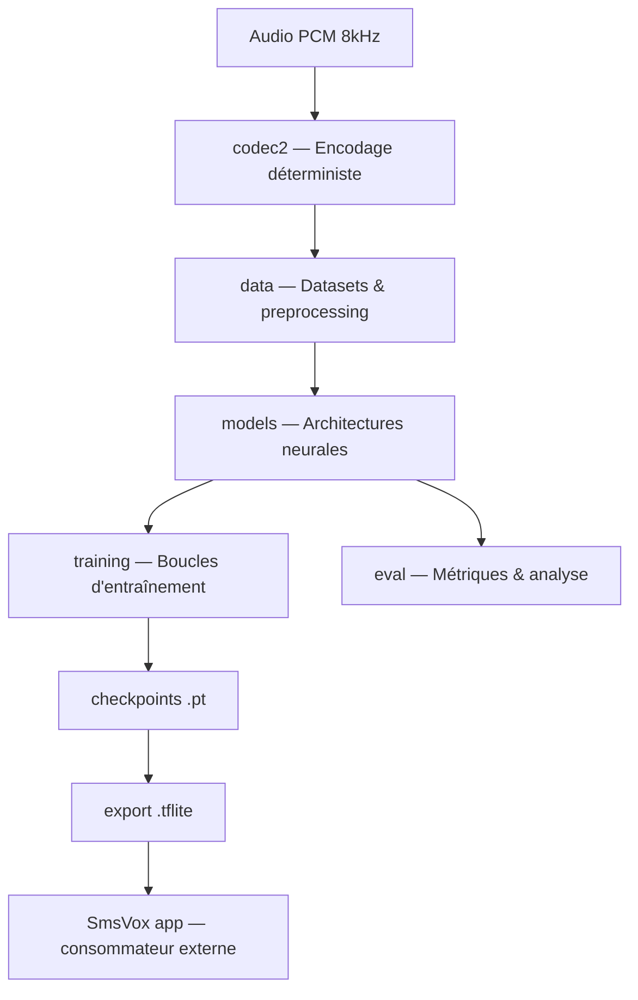
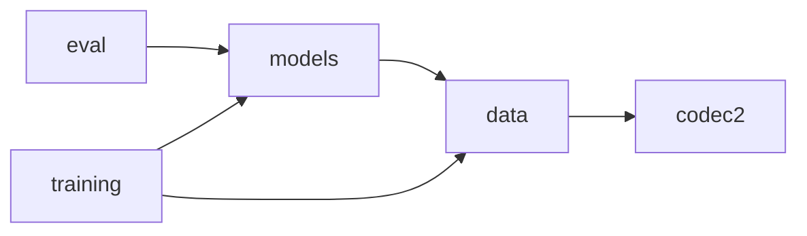
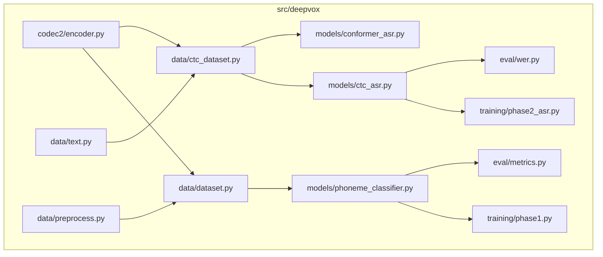

# Architecture Spine — DeepVox

## Design Paradigm

**Layered Pipeline** — chaque couche transforme une représentation et ne dépend que de la couche précédente. Aucune couche ne connaît l'existence des couches au-dessus d'elle.



Direction des dépendances :



## Invariants & Rules

### AD-1 — Layered Pipeline strict [ADOPTED]

- **Binds:** all
- **Prevents:** couplage circulaire entre phases expérimentales ; un changement de modèle qui casse le preprocessing
- **Rule:** `codec2` → `data` → `models` → `training`/`eval`. Chaque module n'importe que depuis les modules à sa gauche. Jamais d'import `training` depuis `models` ni `models` depuis `eval`.

### AD-2 — Codec2 déterministe comme représentation pivot [ADOPTED]

- **Binds:** all
- **Prevents:** dérive vers un codec neuronal appris (EnCodec, SoundStream) qui invaliderait l'hypothèse de recherche fondatrice
- **Rule:** Toute feature extraite de l'audio DOIT passer par Codec2 1200 bps. Aucun modèle ne consomme directement du mel-spectrogram ou du PCM brut sauf à titre de baseline comparatif (conditions C/D).

### AD-3 — Mono-encodage 8 kHz / 1200 bps [ADOPTED]

- **Binds:** codec2, data
- **Prevents:** fragmentation si plusieurs modes coexistent (700C, 3200, etc.)
- **Rule:** Un seul mode Codec2 : 1200 bps, 8 kHz mono, frames de 40 ms (48 bits = 6 octets). Toute donnée audio est resamplée en 8 kHz int16 avant traitement.

### AD-4 — CTC comme stratégie de décodage ASR [ADOPTED]

- **Binds:** phase-2-asr, phase-3-multilingual
- **Prevents:** explosion de complexité encoder-decoder ; autoregressive decode incompatible avec le temps-réel mobile
- **Rule:** Les modèles ASR utilisent CTC loss + greedy decode (ou beam search avec LM externe). Pas d'attention cross encoder-decoder.

### AD-5 — Tokenizer caractères sans vocabulaire appris [ADOPTED]

- **Binds:** phase-2-asr, phase-3-multilingual, phase-4-translation
- **Prevents:** dépendance à un vocabulaire BPE/SentencePiece spécifique à une langue ; facilite l'extension multilingue
- **Rule:** Tokenizer = blank + unk + caractères Unicode de la langue cible. Ajout d'une langue = extension du vocabulaire par concaténation, jamais de re-tokenization.

### AD-6 — Convention Dataset uniforme [ADOPTED]

- **Binds:** data, training
- **Prevents:** incompatibilité DataLoader/collate_fn entre phases
- **Rule:** Tout Dataset retourne `(features: Tensor, labels: Tensor, lengths: Tensor)`. La collate_fn pad dynamiquement. `__getitem__` retourne `None` pour les fichiers corrompus (filtrés par le collate).

### AD-7 — TFLite comme format de livraison [ADOPTED]

- **Binds:** phase-5-compression
- **Prevents:** fragmentation des runtimes mobiles (SmsVox consomme exclusivement TFLite)
- **Rule:** L'artefact de production est un `.tflite` quantifié INT8. ONNX est un format intermédiaire de conversion, jamais de livraison.

## Consistency Conventions

| Concern | Convention |
| --- | --- |
| Nommage fichiers | `snake_case.py` partout |
| Nommage classes | `PascalCase` |
| Nommage constantes | `UPPER_SNAKE_CASE` (constantes domaine immuables) |
| Imports | `from __future__ import annotations` en ligne 1 de tout fichier |
| Types | Syntaxe 3.10+ : `X | None`, `list[T]`, jamais `Optional`/`Union` |
| Docstrings | Google-style avec Args/Returns, formes tensorielles documentées |
| Erreurs | `RuntimeError` avec message actionnable ; `None` return pour données corrompues |
| Training | AdamW (weight_decay=1e-2), gradient clip=5.0, ReduceLROnPlateau |
| Métriques | CER pour early stopping ASR ; PER pour Phase 1 |
| Progressbar | `tqdm.auto` exclusivement |
| Alignement | IPA via MFA french_mfa (45 phonèmes) ; jamais SAMPA |

## Stack

| Name | Version |
| --- | --- |
| Python | 3.10–3.12 |
| PyTorch | >=2.2 |
| torchaudio | >=2.2 |
| Codec2 (C library) | 1200 bps mode |
| pycodec2 | latest (binding Python) |
| Montreal Forced Aligner | french_mfa model (IPA) |
| praatio | latest (TextGrid parsing) |
| ruff | >=0.4 (lint, line-length=100) |
| pytest | >=8.0 |
| Kaggle T4 GPU | CUDA (entraînement) |

## Structural Seed

```text
src/deepvox/
  codec2/          # Wrapper Codec2 C → Python (encode/decode/unpack)
  data/            # Datasets PyTorch, preprocessing, tokenizer caractères
  models/          # Architectures neurales (classifier, BiLSTM-CTC, Conformer)
  training/        # Boucles par phase (phase1.py, phase2_asr.py)
  eval/            # Métriques (PER, WER, CER, confusion matrix)

scripts/           # Scripts expérimentaux (runs, ablations, évaluation)
notebooks/         # Exploration interactive (local + Kaggle)
docs/              # Documentation de recherche (retours d'expérience)
paper/             # Article scientifique
checkpoints/       # Poids sauvegardés (.pt)
data/              # Données locales (non versionnées, >50 Go)
```



## Capability → Architecture Map

| Capability | Lives in | Governed by |
| --- | --- | --- |
| Encodage Codec2 | `codec2/encoder.py` | AD-2, AD-3 |
| Phoneme classification | `models/phoneme_classifier.py` | AD-1, AD-6 |
| ASR CTC (BiLSTM) | `models/ctc_asr.py` | AD-4, AD-5, AD-6 |
| ASR CTC (Conformer) | `models/conformer_asr.py` | AD-4, AD-5, AD-6 |
| Preprocessing & alignment | `data/preprocess.py` | AD-3, conventions IPA |
| Tokenization | `data/text.py` | AD-5 |
| Export mobile | (Phase 5) | AD-7 |
| Intégration SmsVox | artefacts .tflite | AD-7, découplage total |

## Deferred

| Decision | Reason it can wait |
| --- | --- |
| BiLSTM vs Conformer pour production | Run #4 en cours ; étude comparative doc/16 disponible — à trancher après résultats corpus complet |
| Architecture TTS (Phase 3) | Pas encore démarrée ; dépend des résultats ASR finaux |
| Stratégie multilingue (vocabulaire partagé vs séparé) | Phase 3 ; l'AD-5 permet l'extension par concaténation |
| Pipeline de traduction (Phase 4) | Trop tôt ; cascade ASR+MT+TTS vs end-to-end à évaluer |
| Stratégie de quantization INT8 | Phase 5 ; dépend du modèle final retenu |
| KenLM vs neural LM pour beam search | Run #5 ; tester d'abord KenLM (plus léger) |
| CI/CD et déploiement | Pas de production ; projet de recherche pour l'instant |
| Mode 700C de Codec2 | Reporté ; 1200 bps validé, 700C en ablation future |
