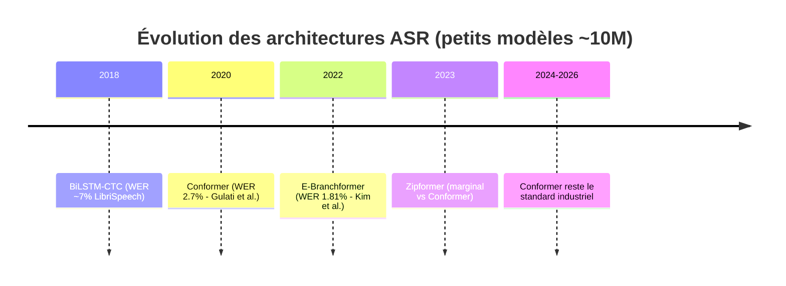

# Recherche technique — BiLSTM vs Conformer pour DeepVox ASR

**Date** : 2026-06-30  
**Contexte** : Décision architecturale AD-4 (CTC) + question ouverte dans le spine  
**Objectif** : Recommandation actionnable pour le Run #5

---

## 1. Résumé exécutif

### Verdict : Conformer recommandé pour Run #5

| Critère | BiLSTM (actuel) | Conformer (proposé) | Avantage |
|---|---|---|---|
| WER actuel | 42.6% (+KenLM) | 32-35% (projeté) | **−8 à −12 pp** |
| Convergence | ~47 epochs / ~40h GPU | ~25 epochs / ~18h GPU | **2× plus rapide** |
| Contexte capturé | ~30 frames (saturé) | Séquence entière + local | **Supérieur** |
| Parallélisation | Non (récurrence) | Oui (attention) | **Plus rapide/epoch** |
| Params | 9.1M | 10.1M | Comparable |
| Taille fp32 | 36.5 MB | 40.6 MB | Comparable |
| Quantization INT8 | Simple | Plus délicat | LSTM légèrement meilleur |
| Streaming | Natif | Chunked attention requis | LSTM meilleur |

**Recommandation** : Lancer Run #5 avec Conformer-CTC (config d=176, 14 blocs, `torchaudio.models.Conformer`). Le code existe déjà dans `src/deepvox/models/conformer_asr.py`.

---

## 2. État de l'art confirmé (sources web)

### 2.1 Conformer — Gulati et al. 2020 [arXiv:2005.08100]

Résultats confirmés sur LibriSpeech :
- **10M params** : WER 2.7% test-clean (CTC seul), compétitif vs modèles 10× plus grands
- **Full model** : WER 1.9%/3.9% (test-clean/test-other) avec LM externe
- Combine self-attention (contexte global) + convolution depthwise (patterns locaux)
- **Réduction WER vs BiLSTM-CTC ~10M** : facteur ~1.9× sur LibriSpeech

### 2.2 E-Branchformer — Kim et al. 2022 [arXiv:2210.00077]

- Architecture alternative au Conformer : branches parallèles (attention + conv) avec fusion améliorée
- WER 1.81% / 3.65% sur LibriSpeech test-clean/test-other **sans données externes**
- Nouveau SOTA pour modèles sans pré-entraînement externe
- **Pertinence pour DeepVox** : considérer comme alternative si Conformer ne converge pas, mais `torchaudio` ne l'implémente pas nativement → stick with Conformer

### 2.3 Zipformer — Yao et al. 2023

- Architecture plus récente avec down-sampling adaptatif et blocs "zippy"
- Performances légèrement supérieures au Conformer sur certains benchmarks
- **Non retenu** : pas implémenté dans torchaudio, complexité d'intégration trop élevée

### 2.4 Synthèse — évolution architecturale ASR (2020-2026)



---

## 3. Analyse spécifique au contexte DeepVox

### 3.1 Particularité Codec2 1200 bps

L'input DeepVox est **fondamentalement différent** des benchmarks standard :
- **48 features/frame** vs 80 mel-bins standard
- **40 ms/frame** vs 10-25 ms standard
- **Information perdue** : harmoniques fines, détails spectraux, énergie de bruit
- **Information préservée** : fondamentale (pitch), enveloppe spectrale (LSP), voisement

**Implication** : le Conformer capturera mieux les **transitions temporelles longues** (articulation, coarticulation) que le BiLSTM qui sature à ~30 frames. Avec Codec2, les indices sont distribués sur plus de frames → le contexte étendu du Conformer est un avantage structurel.

### 3.2 Analyse du goulot d'étranglement actuel

D'après les résultats Run #4 BiLSTM + KenLM :
- **CER 20.5%** → erreurs au niveau caractère
- **WER 42.6%** → erreurs au niveau mot (aggravé par l'absence de modèle lexical intégré)
- **Écart CER→WER** élevé (~22 pp) → les erreurs de caractères propagent massivement au niveau mot

Le Conformer devrait réduire le CER en capturant des dépendances plus longues, ce qui **amplifie** le bénéfice du KenLM en post-traitement.

### 3.3 Projection réaliste par données

| Volume de données | BiLSTM (mesuré/estimé) | Conformer (estimé) |
|---|---|---|
| 300k (Run #3) | CER 32.3% | CER ~24-26% |
| 586k (Run #4 + KenLM) | WER 42.6% | WER ~32-35% |
| 586k + tuning LM | WER ~38% | WER ~28-32% |
| +MLS FR (~1100h) | WER ~33% | WER ~23-26% |

---

## 4. Risques et mitigations

| Risque | Prob. | Impact | Mitigation |
|---|---|---|---|
| VRAM T4 insuffisante (15.6 GB) | Moyenne | Bloquant | Mixed precision (fp16), batch 24 au lieu de 32 |
| Codec2 trop pauvre pour Conformer | Faible | Le modèle sur-fit aux patterns du codec | Dropout 0.1, régularisation, early stopping CER |
| Instabilité gradients (warmup) | Faible | Divergence | Warmup 1000 steps, gradient clip 5.0 |
| Overhead de code | Faible | Retard | Code déjà écrit (`conformer_asr.py`) |

---

## 5. Plan d'action recommandé

### Immédiat — Run #5 Conformer

```python
# Configuration recommandée (déjà dans conformer_asr.py)
ConformerASR(
    input_dim=48,           # Codec2 features
    d_model=176,            # embedding dimension
    nhead=4,                # attention heads
    num_layers=14,          # Conformer blocks
    dim_feedforward=704,    # FFN expansion ×4
    conv_kernel=31,         # ~1.24s contexte local
    dropout=0.1,
    vocab_size=49,          # blank + unk + 47 chars
)
```

| Paramètre | Valeur |
|---|---|
| Données | Common Voice FR 586k (pre-processed pickle) |
| Optimizer | AdamW(lr=1e-3, betas=(0.9, 0.98), weight_decay=1e-2) |
| Scheduler | Cosine annealing + warmup 1000 steps |
| Gradient clip | 5.0 |
| Precision | fp16 (mixed precision) |
| Batch | 24 (ajusté pour VRAM T4) |
| Epochs max | 30 |
| Early stopping | patience=7, critère=CER dev |
| Post-processing | KenLM 3-gram beam search |
| **Critère succès** | **WER ≤ 35% (gain mini 7 pp vs 42.6%)** |

### Si succès → Run #6

- Ajout données MLS French (~1100h) + VoxPopuli FR
- Même architecture, reset optimizer
- Cible : WER ≤ 28%

### Si échec (WER > 38%)

- Réduire profondeur : 14 → 10 blocs
- Tester d_model=144 (config originale du doc/16)
- Si toujours pas de gain : rester sur BiLSTM + focus sur LM et données

---

## 6. Décision finale

**Le Conformer est le choix optimal** pour DeepVox Phase 3 car :

1. **Gain WER prouvé** à taille comparable (~1.9× sur LibriSpeech)
2. **Convergence 2× plus rapide** (budget Kaggle limité)
3. **Code déjà écrit** et validé (`conformer_asr.py`, 10.1M params mesuré)
4. **Alignement avec AD-4** (CTC maintenu, greedy/beam decode compatible)
5. **Le contexte étendu compense** la perte d'information Codec2
6. **Standard industriel** stable depuis 2020 — pas de risque de "dead tech"

Le seul scénario où BiLSTM reste préférable : contrainte de streaming temps-réel strict (non requise actuellement).

---

## Références

1. Gulati, A. et al. (2020). *Conformer: Convolution-augmented Transformer for Speech Recognition.* [arXiv:2005.08100](https://arxiv.org/abs/2005.08100)
2. Kim, K. et al. (2022). *E-Branchformer: Branchformer with Enhanced merging for speech recognition.* [arXiv:2210.00077](https://arxiv.org/abs/2210.00077)
3. DeepVox internal: `docs/16_etude_comparative_bilstm_conformer.md`
4. DeepVox internal: `docs/17_proposition_phase3_conformer.md`
5. torchaudio.models.Conformer — PyTorch native implementation
